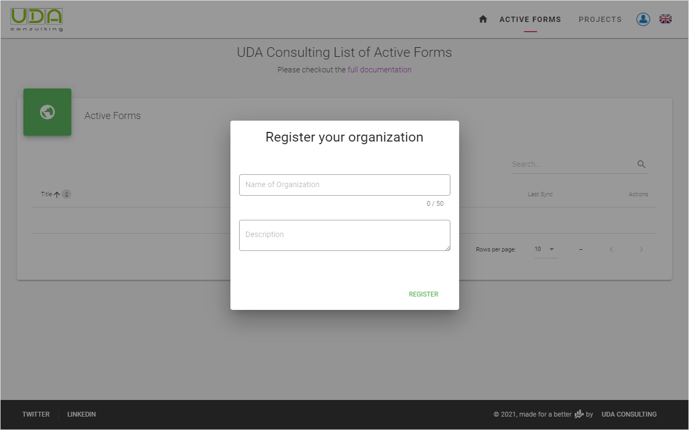
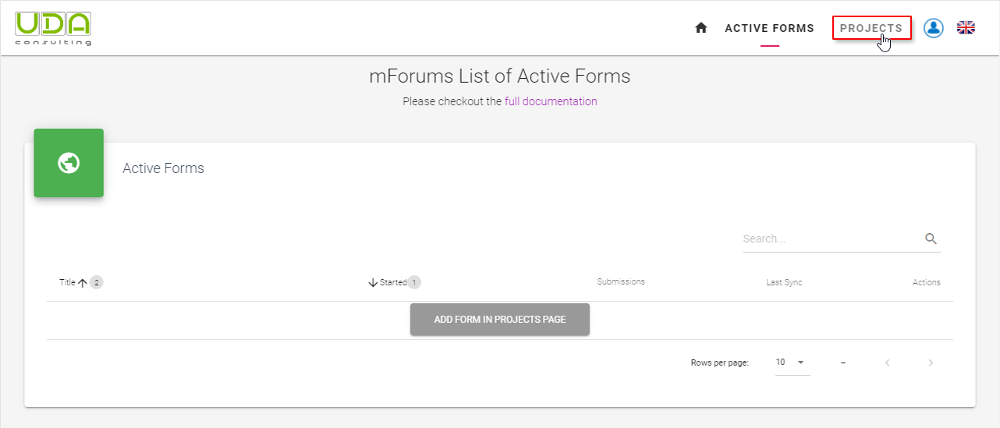
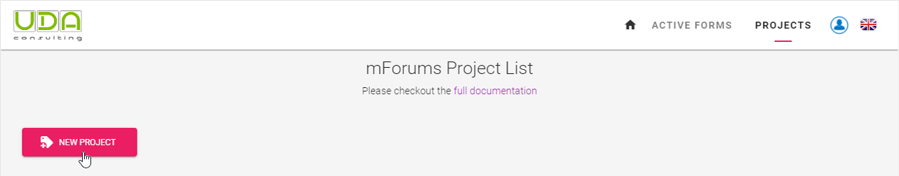
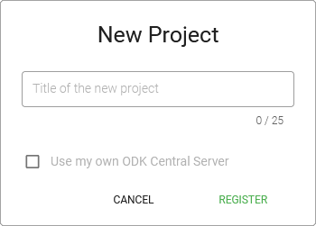
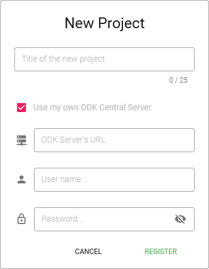
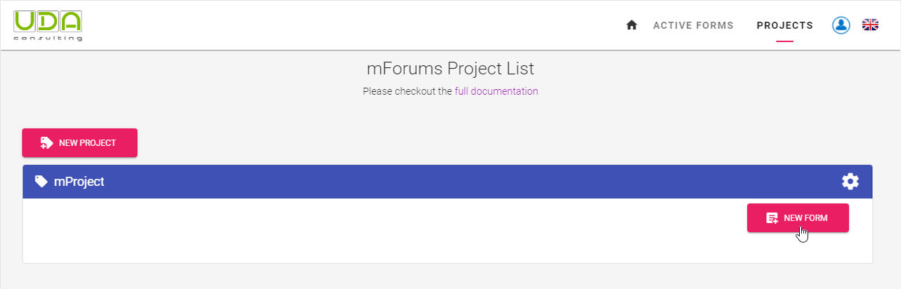
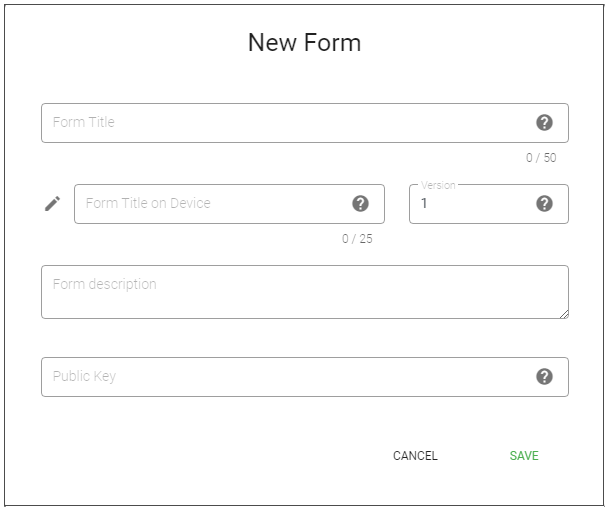
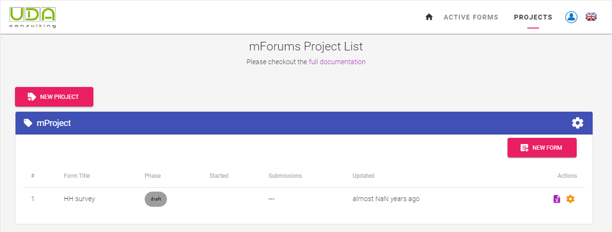

# Initial setup

To start using the system first you need to register your organization. After successfully signed into the system you'll be asked to enter the name of your organization

To start using the system you need to register a new project. Click `ADD FORM IN PROJECTS PAGE` button the under the **Active Forms** section or `PROJECTS` menu

## Register a Project

**Step 2.2** Each survey form belongs to a project. Therefore, first, you need to register a new project. In **Projects** page click on the `New Project` button.

Then enter the title of you project in the popup dialog box and click `REGISTER`

::: tip Using your own ODK Central Server
1. Click the `Use my own ODK Central Server` checkbox
   
2. New users by default will not have any access to any project.
3. Grant access to a web user is done from [Project Settings](./04-projects.html#project-settings.md).
:::

## Add a Survey Form

**Step 2.3** Now you can register a survey form. First, click the `NEW FORM` button inside the project block.

In the `New Form` dialog box enter the title for the survey form into `Form Title on Device` field. This title will be displayed on Devices. `Instance Name` is automatically generated from the Form title, but you also can manually change it by clicking on the pencil image.  Survey form’s default version is 1, change / increase it when needed. Add some description test about your survey form and click the `Save` button.

Now your new form is registered and you are ready to  [upload your XLSForm](./11-upload-xlsform.html).

