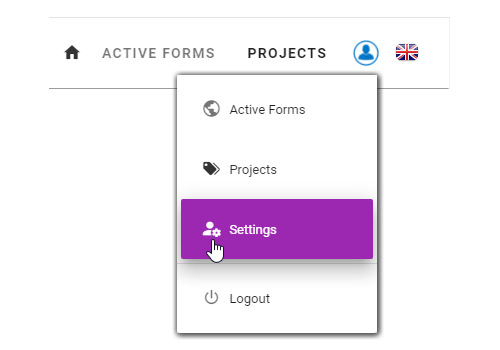
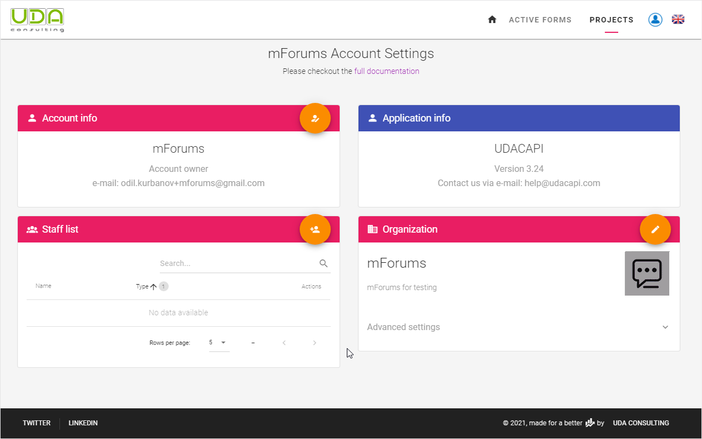
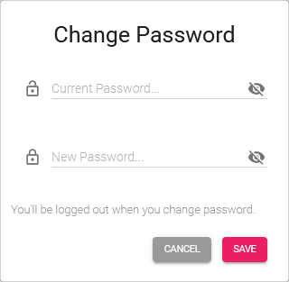
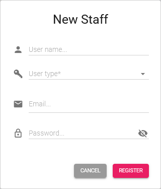

# Account Settings

Account settings are available from `Settings` of account menu

In this section you can change details of your account, register a new web users and edit your organization's details

## Account Info

Use this block to change your password. Click the button on the left top corner of the block to change your password.

You need to enter your **Current Password** into the first field and your **New Password** to the second field

## Register a New User

To register a new web user click the button on the left top corner of this block. 

You can register two types of web users: **Staff** and **Client**. Staff can see other web users of your organization, while clients can see only Account Owner and project manager.

::: details User Types: Use Case
When you have several projects from different clients, you most likely want that each of your clients could see only those data that they are related with. To achieve this you need to register a new web user as a client. Then you assign a relevant project for this client in the Project Settings section.
:::

::: tip
1. Web user's access levels are project based. 
2. New users by default will not have any access to any project.
3. Grant access to a web user is done from [Project Settings](./04-projects.html#project-settings.md).
:::