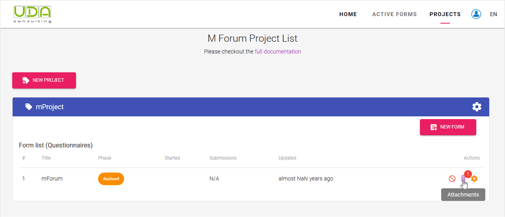

# Upload XLSForm

When XLSForm of your survey form is ready you can upload it into the platform. Click `Upload XLSForm` button under the `Actions` column in `Projects` page:

**Step 4.1** In the `Upload XLSForm` dialog box click on `Select XLSForm file` field to navigate and attach your **XLSForm** (Excel file), then add your survey from's default language into `Select default language` field.

When you are ready click the `UPLOAD` button.

::: tip
UDACAPI platform will generate the settings based on Form details. [Settings worksheet](http://xlsform.org/en/#settings-worksheet) of uploaded XLSForm will be ignored. You can change form details by clicking UPDATE button.
:::

**Step 4.2** If the XLSForm has no errors your survey form will be deployed into the server. If you have any media / csv files attached to your form you will be able to upload them by clicking on the `Attachments` button.

Now you are ready to [test and publish your XLSForm](/guide/12-test-form.html).