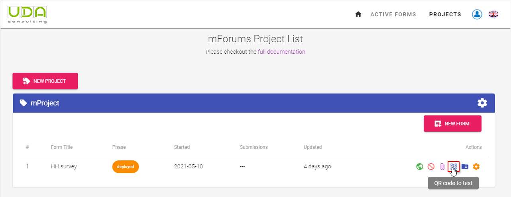
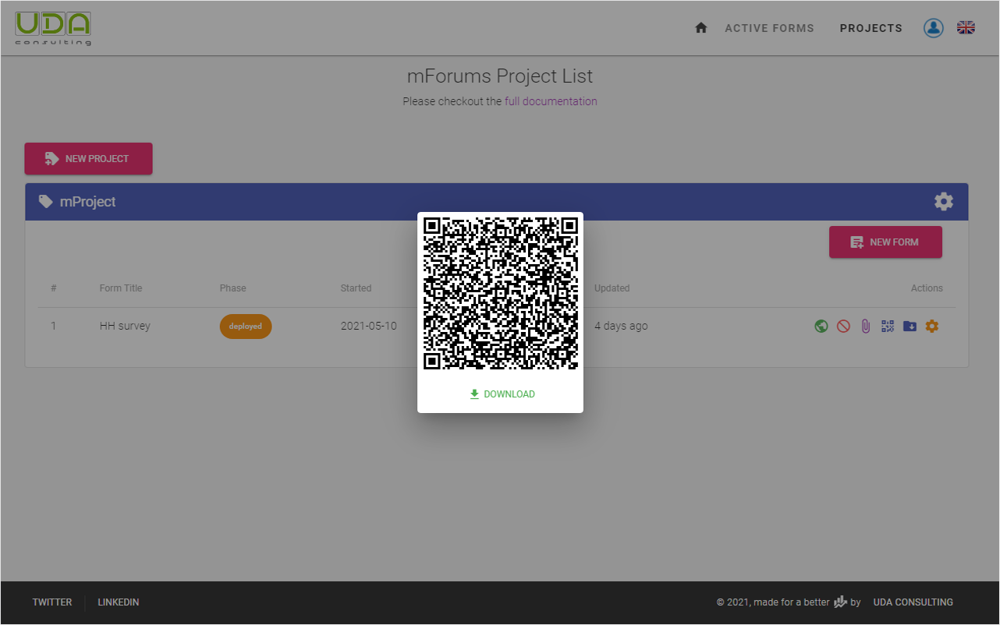
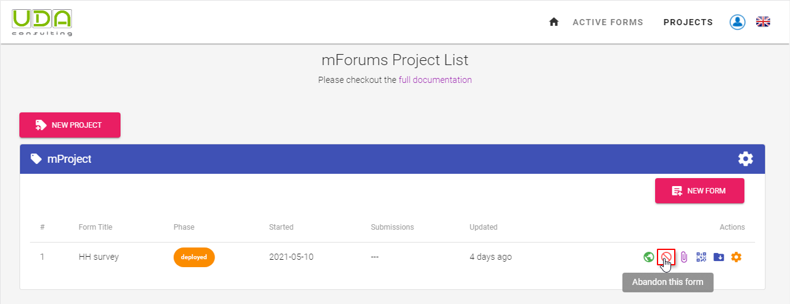
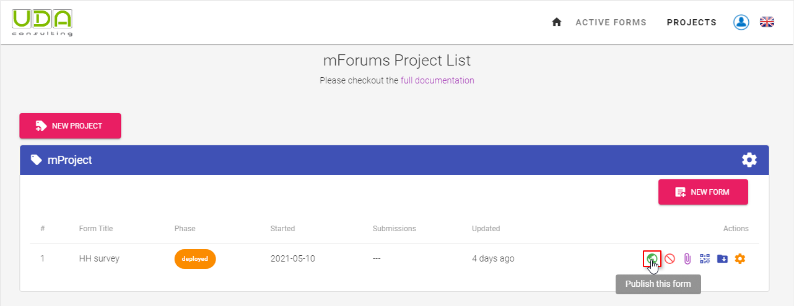

# Test and publish form

## Submit test data

**Step 5.1** When you successfully deploy the form with all possible attachments, you can test your survey form before you publish the final version. To test your deployed survey form you need the QR Code of this form.

**Step 5.2** Click the QR Code image and scan it with your [ODK Collect](/guide/15-odk-collect.html) application or download it to share with your colleagues who will test the survey form.

**Step 5.3** When you submit several survey forms to the server you can download and see the dataset. Click the Download test data button to get the archived csv file.

**Step 5.4** You can abandon the current draft and upload a new / revised XLSForm. You don't need to increase the form version in this case. Click the `Abandon` button to be able to upload a new draft.

## Publish form

**Step 5.5** You can publish your draft form when you make sure that your survey form works as expected and you checked the dataset.

::: warning
**Please note**: When you publish the Draft Form, all test Submissions will be permanently removed.
:::
