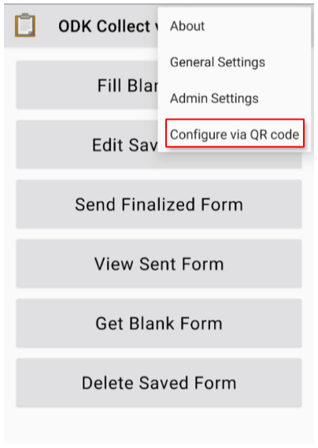
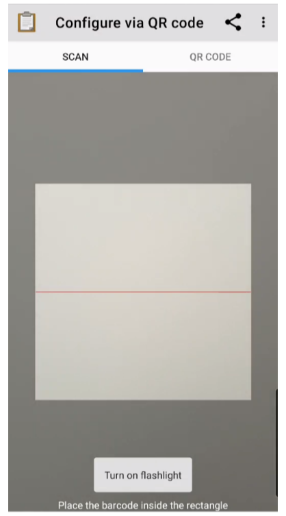
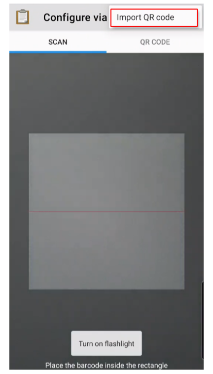
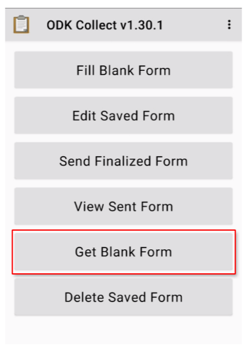
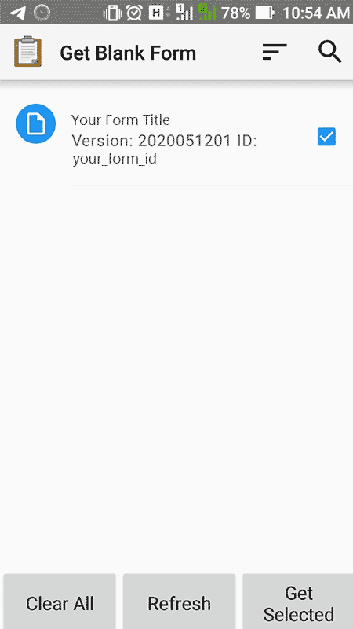
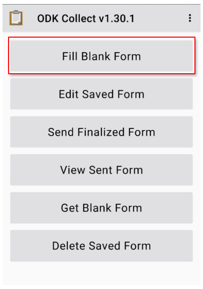

# ODK Collect

ODK Collect is an open source, phone-based replacement for your paper forms. It renders a form, survey, or algorithm into prompts that support complex logic, repeating questions, and multiple languages. Data types include location, audio, images, video, barcodes, signatures, multiple-choice, free text, and numeric answers. Collect is part of the Open Data Kit tool suite. For in-depth guide to using the Collect App see the official [ODK Documentation](https://docs.getodk.org/collect-using/)

## Quick start

Download [ODK Collect](https://play.google.com/store/apps/details?id=org.odk.collect.android&hl=en) from Google Play market 

Open it and go to the `Configure via QR code`

To scan QR code from image read the QR code generated for [Deployed forms](./12-test-form.html#submit-test-data.md) or [Data Collects](./20-data-collectors.md)'s QR code from Project settings.

Or, if you want to scan the QR code from the device, click on `Import QR code` and select the QR code on your device.

Go back to the main page and click `Get Blank Form` button

Select the relevant questionnaire and click `Get Selected` button

Go back to the main page. Now you can test the Survey form using `Fill Blank Form` button

