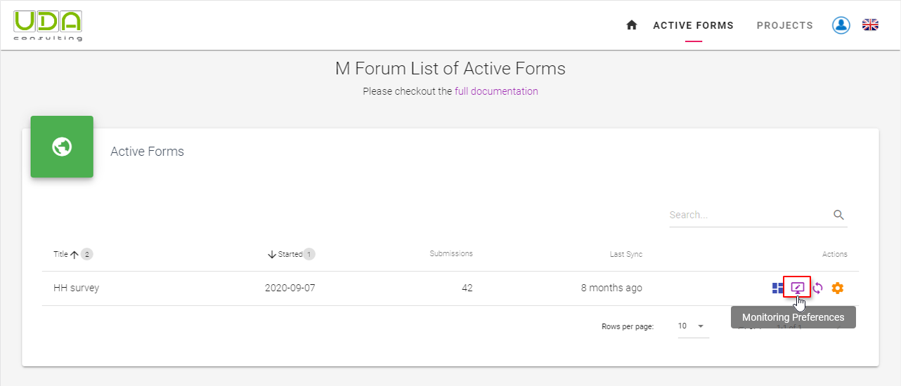
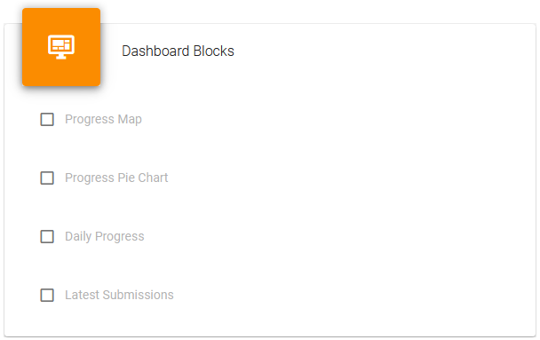
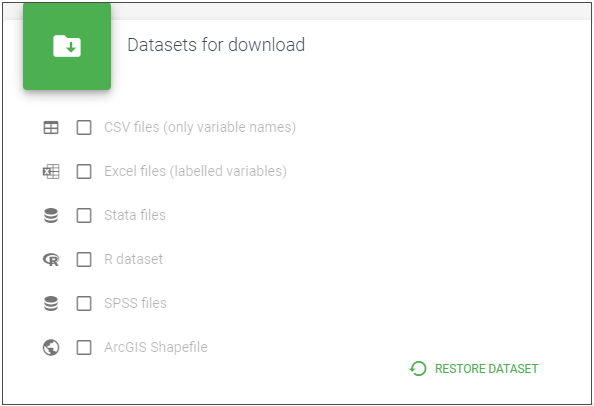
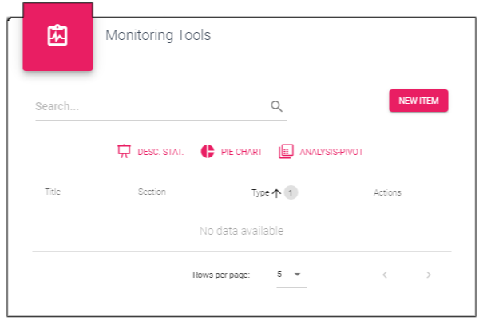
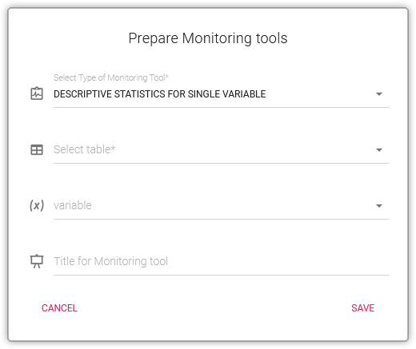
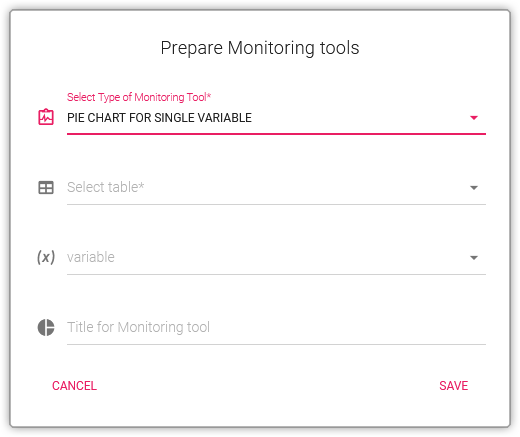
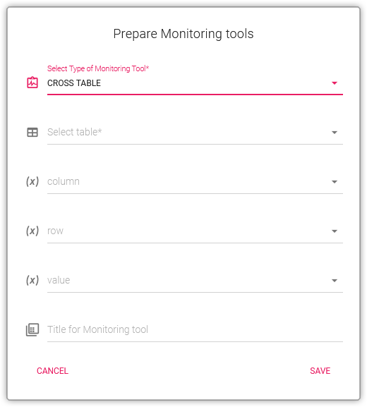

# Monitoring Preferences

For each published form you need to assign you preferences to start Monitoring of data collection. Click the `Monitoring preferences` button to see all possible settings.

## Monitoring blocks

Monitoring blocks is section with information about the submissions from your survey form. If you collect GPS or calculate latitude and longitude data you monitor the `Progress on the map`. There are also `Progress Pie`, `Daily Progress` and `Latest Submissions` blocks available. You can activate them. Only selected block will be included into your Dashboard

## Types of Dataset
 
UDACAPI allows download your dataset in any of the following formats. Activate any of them to be able to download the dataset in that format in Dashboard. 

## Monitoring Tools

With the help of Monitoring tools you can observe responses to any question while collecting data from the field. For numeric answers that could be a `Descriptive Statistics` including *maximum*, *minimum*, and *average* values also *mean*, *median*, *standard deviation*, etc. For categorical variables it could be a `Pie Chart` and `Cross table` as known as Pivot table. To add the monitoring tool click the `New item` button.

### Descriptive Statistics

To add a new descriptive statistics tool you need to Select table and one variable from that table. Then give a title for this tool and click `Save`

### Pie Chart

`Pie Chart` too also requires a *table* to be selected and a variable from that table. Then give a title for this tool and click `Save`

### Cross table

For a `Cross table` tool after selecting a table you also need to choose a variable for *Column*, for *Row* and one for *Value* (as a Value you can select a uniqueID column). Then type a title for this tool and click `Save`

