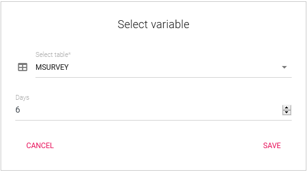
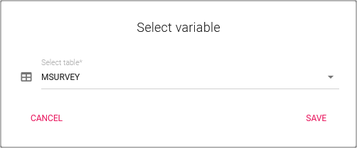
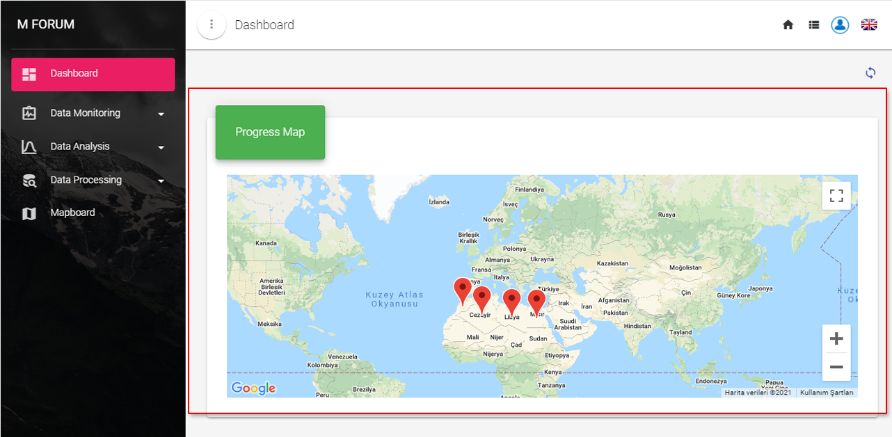
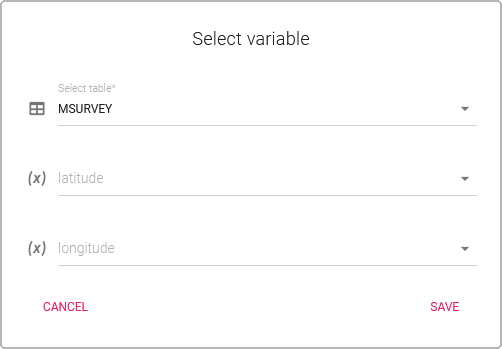
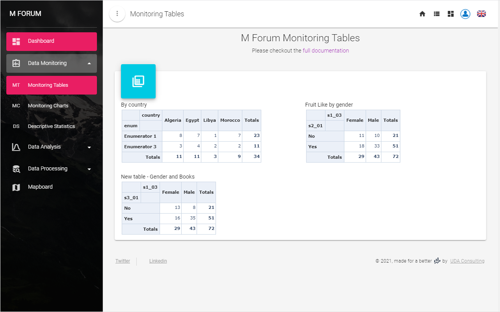
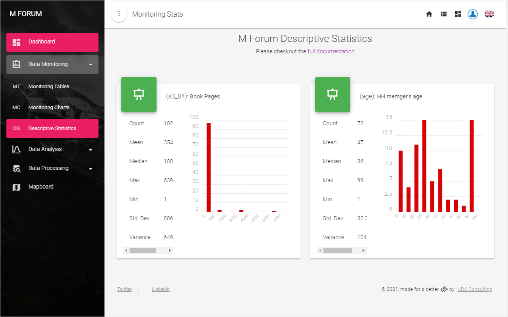
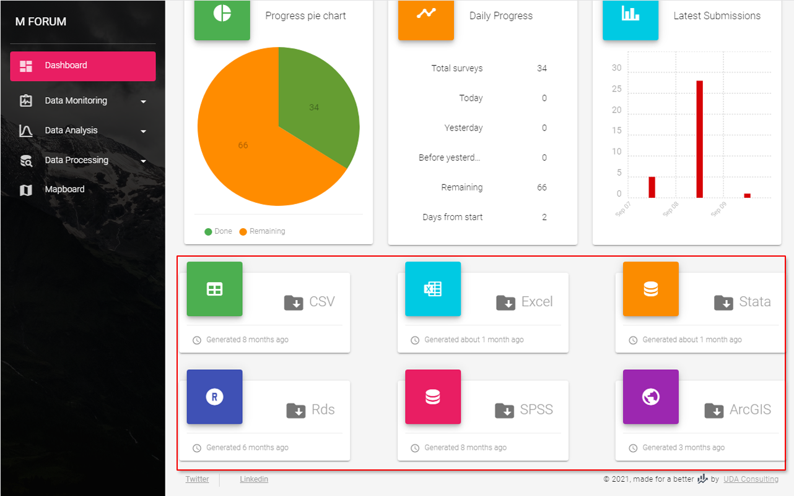
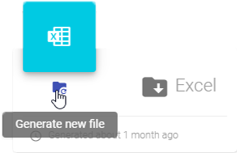
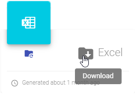

# Dashboard

Dashboard will help you to monitor your data collection process.

## Monitoring Blocks
In this section there are three default blocks: `Completed submissions`; `Last submission` and barchart of `Latest submissions`. More blocks can be addedd using block settings box.

### Default blocks

**Completed submissions** and  **Last submission** are statisistics blocks
 -Completed submissions  -Last submission

**Latest submissions** block is a bar chart indicating trends for last days' data collection statistics. While activating this block you need to indicate the number - how many days you would like to include into this bar chart

Click settings button to opan settings box. 

### Additional blocks
#### Progress pie

To add a progress pie block you need to select a table:

Then, you need to indicate your target - total number of submissions you planned to collect from the field. You find target field in the settings block. The default number is 100, change it accordingly.

 - image target

 - block image

#### Daily progress

The daily progress block will inform about current progress and previous days' statistics in terms of data collection. In this block you can also see the start date of data collection progress and remaining surveys.

Here also you need to indicate your target - total number of submissions you planned to collect from the field. Default number is 100, you change it accordingly.

 - block image

::: tip Note
Dashboard presents you your survey data in near to real time. If you have any queries marked to be exclude from dataset in [Query Builder](./60-data-processing.html#query-builder), than the results of that query will not be included into the data of these blocks.
:::

#### Progress map

If you collect locational data in your survey form, selecting `Progress map` choice let you monitor data collection progress on the map in this Dashboard. This will also activate [Mapboard section](./45-mapboard.md). 

To activate this block you should select `Longitude` and `Latitude` variables from your survey form.

## Data Monitoring

This section contains Monitoring tables and Descriptive statistics sections.

### Monitoring tables

### Descriptive statistics

## Download Datasets

Types of the datasets included into this section also activated via [Monitoring preferences](./21-preferences.html#monitoring-blocks) page. 

To be able to download a dataset of you choice first you should generate the latest version of the data by clicking 

When dataset is generated you can download it

