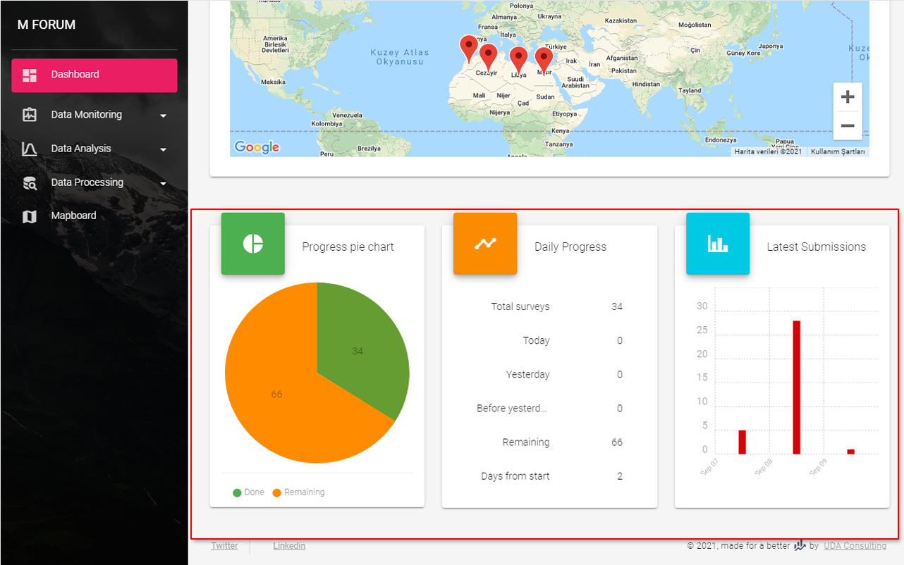

# Dashboard

Dashboard will help you to monitor your data collection process and initially it has no blocks. You should add blocks using [Monitoring preferences](/guide/21-preferences.html#monitoring-blocks).

::: tip Note
Dashboard presents you your survey data in near to real time. If you have any queries marked to be exclude from dataset in [Query Builder](/guide/60-data-processing.html#query-builder), than the results of that query will not be included into the data of these blocks.
:::

## Progress map

If you have locational data you can monitor your survey locations on the map. For this you should turn on this block in [Monitoring preferences](/guide/21-preferences.html#progress-map).

## Dashboard blocks

`Progress pie chart`, `Daily progress` and `Latest submissions` blocks are also activated in [Monitoring preferences](/guide/21-preferences.html#monitoring-blocks) page.

## Download Datasets

Types of the datasets included into this section also activated via [Monitoring preferences](/guide/21-preferences.html#monitoring-blocks) page. 

To be able to download a dataset of you choice first you should generate the latest version of the data by clicking 

When dataset is generated you can download it

