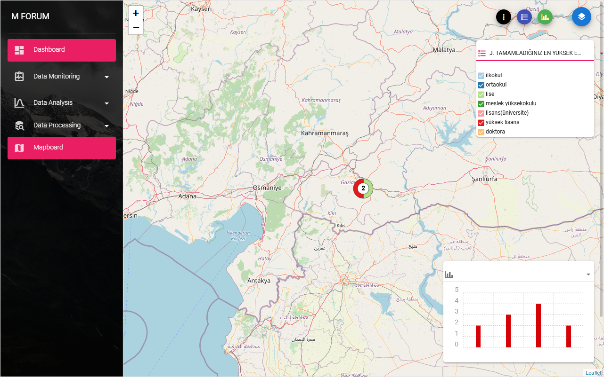
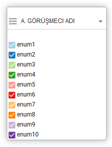
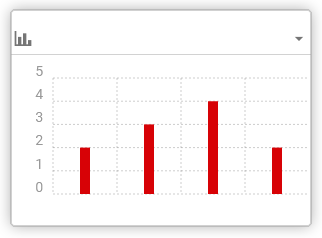

# Mapboard

You can use Mapboard if you collect locational data in your survey form and you activated `Progress map` in [Monitoring preferences](/guide/21-preferences.html##progress-map) page. Mapboard helps you to see the responses for questions with predefined answers as a donut chart on the map.

The first button of the control buttons in the top right corner of `Mapboard`

switches the navigation bar on/off that makes the map full page.

The second button  brings the `Filter tool` - List of categorical questions. Each choice option corresponds to one part of the donut chart and you can switch off response to see data filtered by answers.

The next button  activates the `Histogram tool` an approximate representation of the distribution of numerical data from your survey as a histogram.

This histogram represents distribution of data filtered by above `Filter tool`