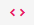

# Data analysis

## Pivot table

`Pivot table` provides dynamic cross analysis of questions. These analysis could be a **cross table**, different **charts** or **heatmap** tables, etc.

First select a table, then questions (e.g. variables) from that table

::: tip
You can switch between question code (variable names) and question labels (variable labels) by clicking the button 
:::
::: details

:::

To change the type `pivot table` click the top left corner of the table and select one of the types from that list.

Cross table view of `pivot table`:

`Heatmap` table view:

If you visualize your data as graphic you can change the view and download it as an image file using a chart toolbar.

## Descriptive Statistics

This section lets you quickly get some statistical indicators (such as count, mean, median, maximum, minimum, standard deviation, variance, etc.) and a histogram - approximate representation of the distribution for questions with numeric values. For this you should select a table and a question.

