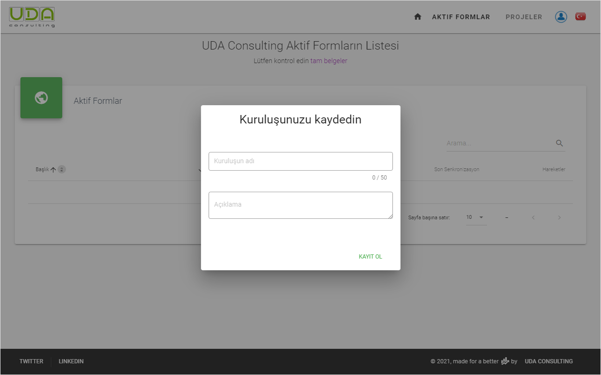
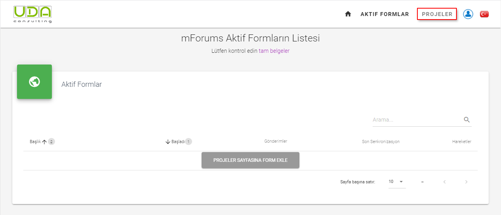
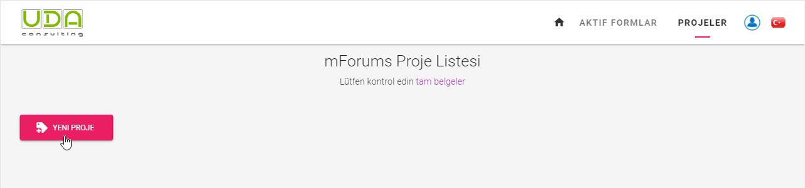
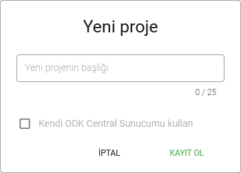
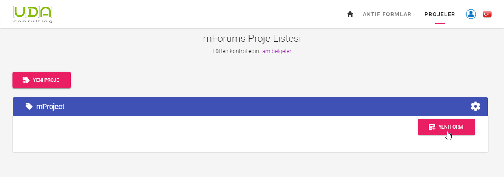
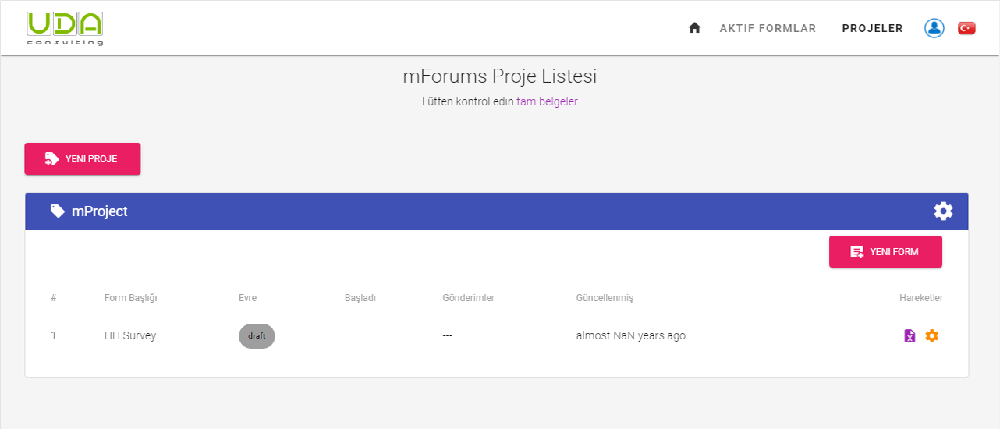

# Başlangıç Ayarları
Sistemi kullanmaya başlamak için önce kuruluşunuzu kaydetmeniz gerekir. Sistemde başarılı bir şekilde oturum açtıktan sonra, kuruluşunuzun adını girmeniz istenecektir.
 

Sistemi kullanmaya başlamak için yeni bir proje kaydetmeniz gerekir. **Aktif Formlar** bölümü veya `PROJELER` menüsü altındaki `PROJELER SAYFASINA FORM EKLE` butonuna tıklayın.
 

 
## Proje Kaydet
 
**Adım 2.2** Her anket formu bir projeye aittir. Bu nedenle önce yeni bir proje kaydettirmeniz gerekiyor. **Projeler** sayfasında `Yeni Proje` butonuna tıklayın.
 

 
Ardından açılır iletişim kutusuna projenizin başlığını girin ve `KAYDET`e tıklayın.
 

 
## Anket Formu Ekle
 
**Adım 2.3** Artık bir anket formu kaydedebilirsiniz. İlk olarak, proje bloğunun içindeki `YENİ FORM` butonuna tıklayın.
 

`Yeni Form` iletişim kutusunda anket formunun başlığını `Cihazdaki Form Başlığı` alanına girin. Bu başlık cihazlarda görüntülenecektir. `Örnek Adı` Form başlığından otomatik olarak oluşturulur, ancak kalem resmine tıklayarak manuel olarak da değiştirebilirsiniz.  Anket formunun varsayılan sürümü 1'dir, gerektiğinde değiştirin / artırın. Anket formunuz hakkında bir açıklama testi ekleyin ve `Kaydet` butonuna tıklayın.
 

 
Yeni formunuz kaydedildi. Artık hazırsınız    [XLSForm’unuzu yükleyin](./11-upload-xlsform.html).
 
