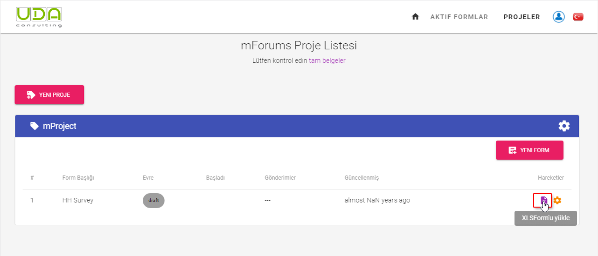
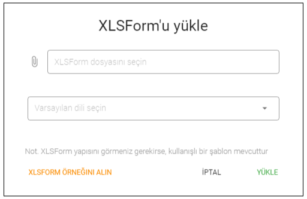

# XLSForm Hazırlama
XLSForm, Excel'de form yazımını basitleştirmeye yardımcı olmak için oluşturulmuş bir form standardıdır. XLSForm'ları kullanmaya başlamak kolaydır, ancak karmaşık formların yazılmasına izin verir. Excel ile tasarlanan formlar, UDACAPI ile kullanılabilen XLSForms'a dönüştürülebilir.
Formunuzu tasarlamak için şuraya bakın: [XLSForm form dizayn dokümantasyon](http://xlsform.org/).
 
Ayrıca UDACAPI'den kullanışlı bir XLSForm MS Excel şablonu da indirebilirsiniz. Bunun için **Projeler** sayfasında `İşlemler` sütununun altındaki `XLSForm Yükle` butonuna tıklayın.
 

 
Daha sonra, XLSForm'un kullanışlı yapısına sahip MS Excel şablonunu almak için `XLSFORM ÖRNEĞİ AL` bağlantısını tıklayın.
 

 
Once you prepare your XLSForm form you can upload it into UDACAPI platform.
 
::: tip
Ayrıca XLSForm formunun - Anketlerin hazırlanması konusunda eğitim de veriyoruz. Lütfen, [bize ulaşın](mailto:info@udaconsulting.com) daha fazla ayrıntı için.
:::
