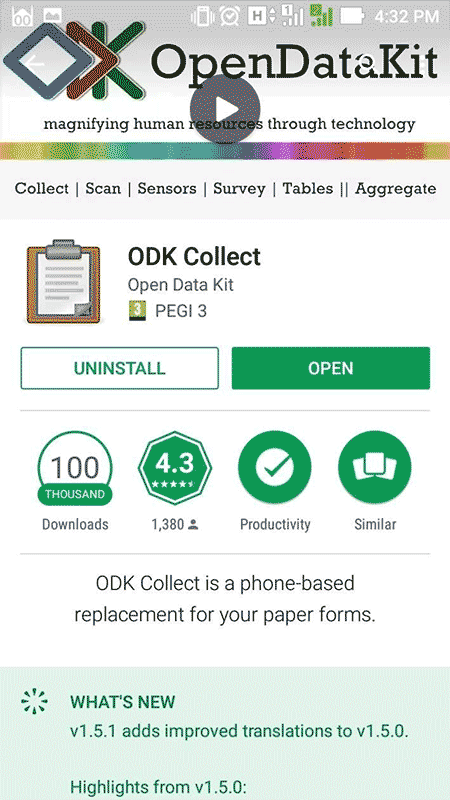
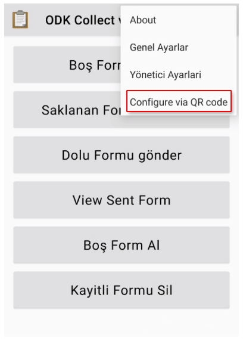
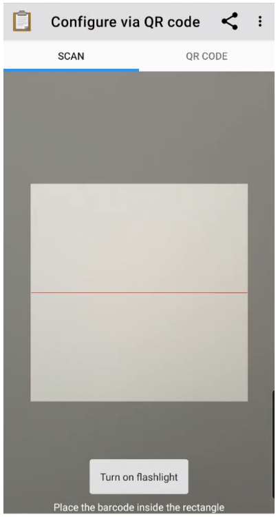
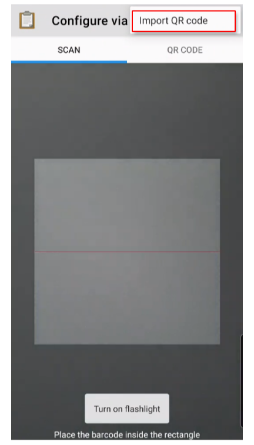
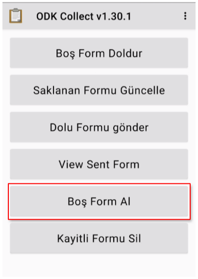
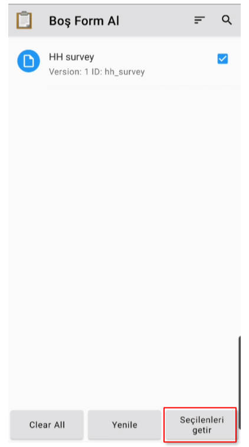
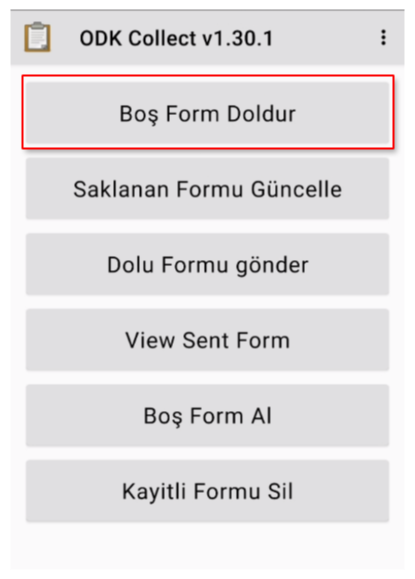

# ODK Collect
 
ODK Collect, kağıt formlarınız için açık kaynaklı, telefon tabanlı bir alternatiftir. Bir form, anket veya algoritmayı, karmaşık mantığı, tekrar eden soruları ve birden çok dili destekleyen istemlere dönüştürür. Veri türleri arasında konum, ses, resimler, video, barkodlar, imzalar, çoktan seçmeli, serbest metin ve sayısal yanıtlar bulunur.Collect, Open Data Kit araç paketinin bir parçasıdır. Collect Uygulamasını kullanımı ile ilgili ayrıntılı kılavuz için; [ODK Documentation](https://docs.getodk.org/collect-using/)
 
## Hızlı Başlangıç
 
Google Play üzerinden indir [ODK Collect](https://play.google.com/store/apps/details?id=org.odk.collect.android&hl=en)  
 

 
Açın ve  `Configure via QR code` a gidin.
 

 
 Daha önce [Yüklenen Form](/tr/guide/12-test-form.html#test-verilerini-gonderin) için oluşturduğunuz ya da [Veri toplayıcılar](/tr/guide/20-data-collectors.html) kısmında bulunan Proje ayarlarındaki QR kodu taratın. 
 

 
Ya da Cihazdan QR kodu taratmak isterseniz, `Import QR code` a tıklayın ve cihazınızdaki QR kodu seçin.

 
Ana sayfaya geri dönün ve `Boş Form Al` butonuna tıklayın.
 

 
İlgili anketi seçin ve `Seçilenleri Getir` butonuna tıklayın.
 

 
Ana sayfaya geri dönün. Artık `Boş Form Doldur` butonunu kullanarak anket formunu test edebilirsiniz.
 

