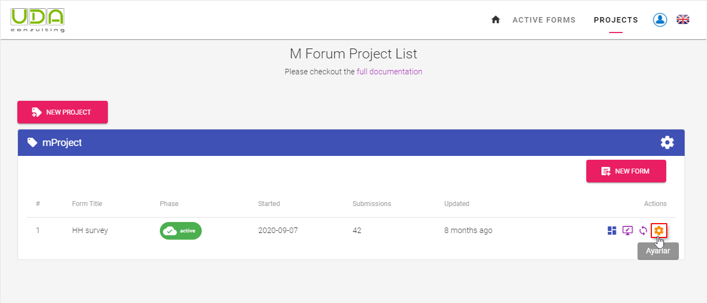
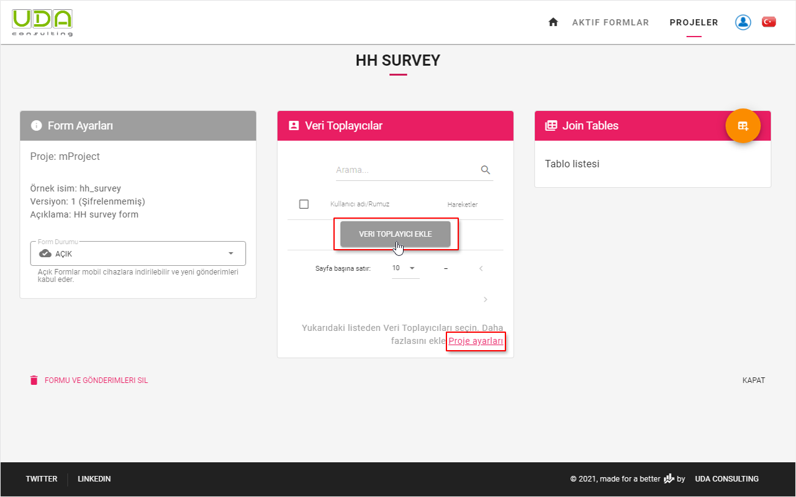
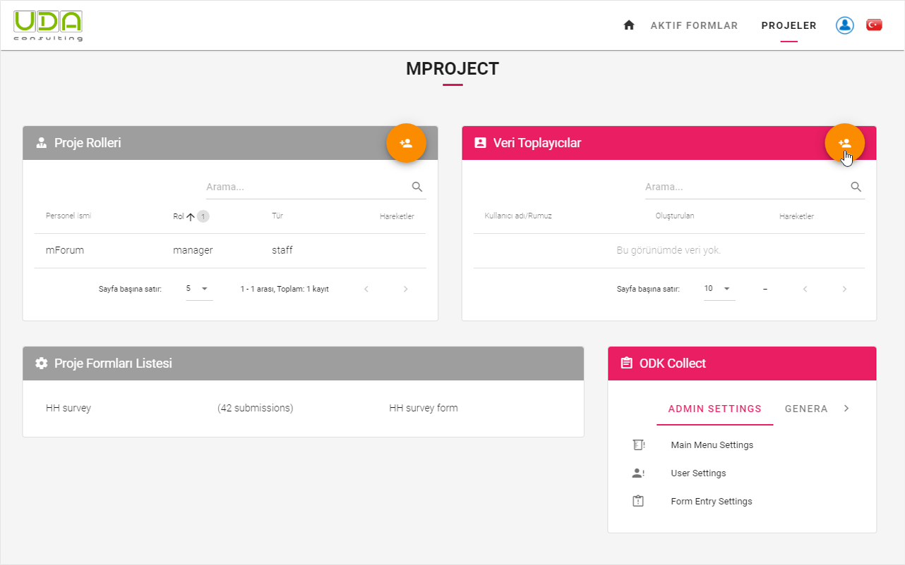
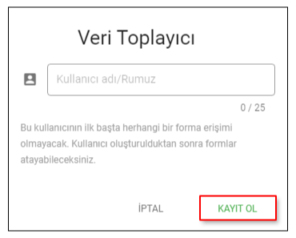
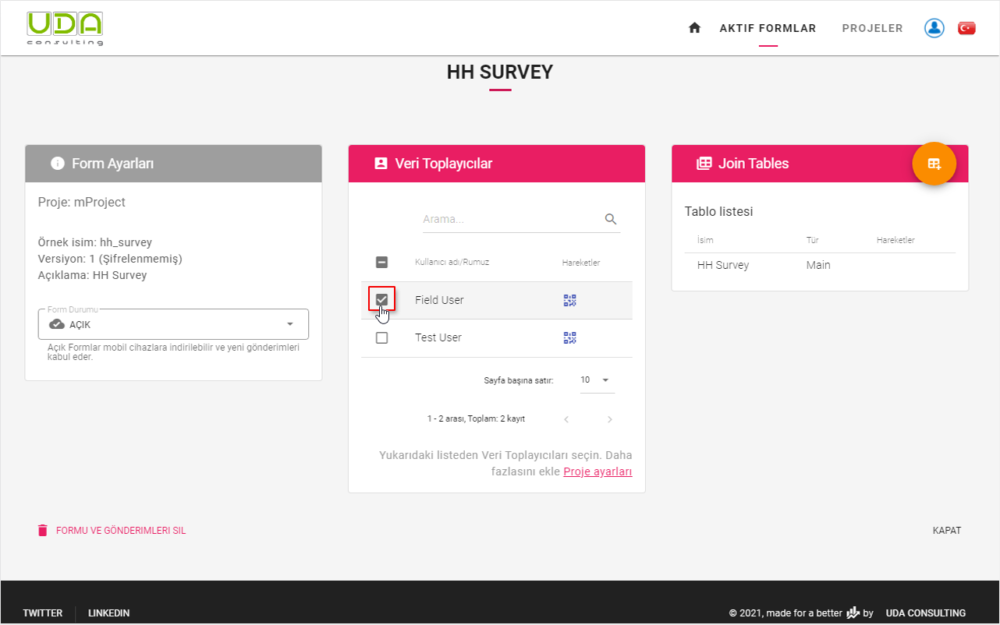
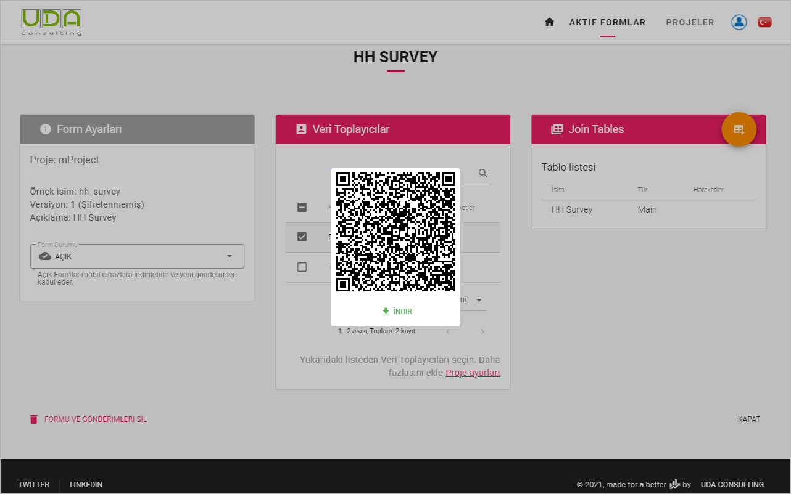

# Veri toplayıcılar
 
Formunuzu yayınladığınızda, sonraki adım, kullanacak Veri Toplayıcı hesabı eklemektir. [ODK Collect](https://play.google.com/store/apps/details?id=org.odk.collect.android&hl=en) - mobil veri toplama uygulamaları, anket verilerini gönderir. Veri Toplayıcılar proje tabanlıdır. Her projenin bir dizi Veri Toplayıcı hesabı olabilir. Proje sahibi, tek bir forma birden fazla Veri Toplayıcı atayabilir. Forma atanırsa Veri Toplayıcılar bu formu form listesi arasında görebilir, ihtiyaç duydukları formları indirebilir ve tamamlanmış gönderimleri bu formlara yükleyebilir.
 
 
**Adım 6.1** Form Ayarları sayfasını açmak için `İşlemler` sütununun altındaki `Ayarlar` butonuna tıklayın
 

 
**Adım 6.2** Proje için Veri toplayıcı yoksa, ilk kullanıcıyı eklemek için `Veri Toplayıcı ekle` butonuna tıklayın. Proje Ayarı bağlantısını tıklayarak her zaman daha fazla Veri Toplayıcı ekleyebilirsiniz.
 

 
**Adım 6.2.1** Proje Ayarlarında, bir Projenin yeni Veri Toplayıcısını kaydetmek için `Ekle` butonuna tıklayın.
 

 
**Adım 6.2.2** Ardından bir isim verin ve `Kaydet` butonuna tıklayın.
 

 
**Adım 6.2.3** Mevcut Veri Toplayıcıyı mevcut forma atamak için sadece onu seçin.
 

 
Artık sadece yukarıda seçilen `Field User` bu formu **ODK Collect** mobil uygulamasındaki mevcut formlar listesinde görebilir ve başvuru gönderebilir. 
 
**Adım 6.3** Sadece QR Kodunu indirmeniz ve sahada veri toplayacak olanlarla paylaşmanız yeterlidir.
 

