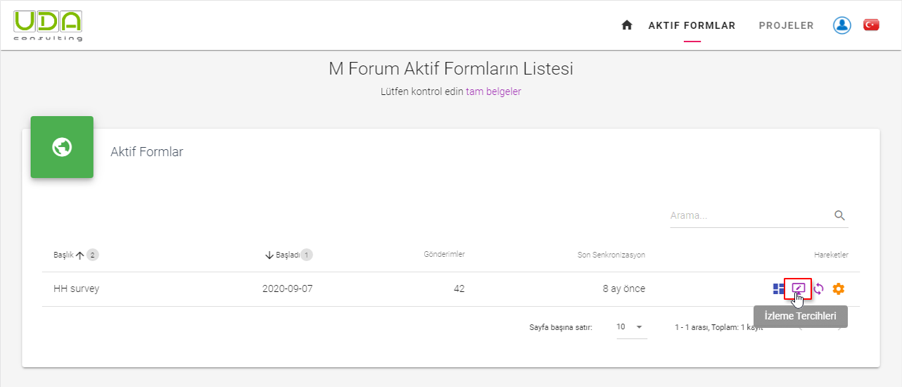
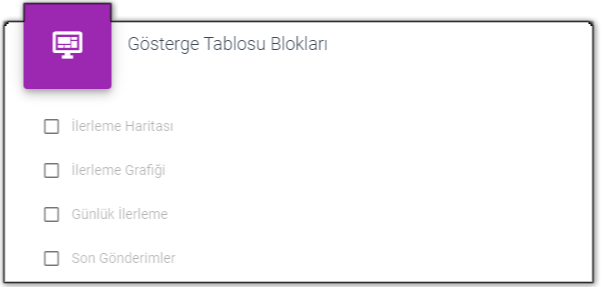
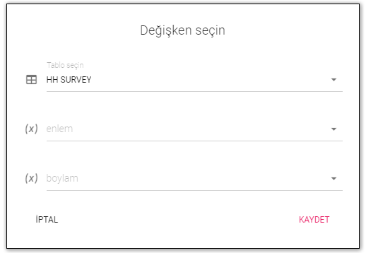
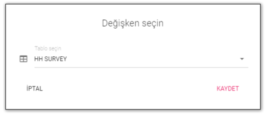
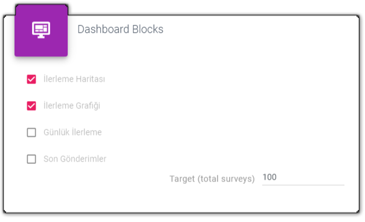
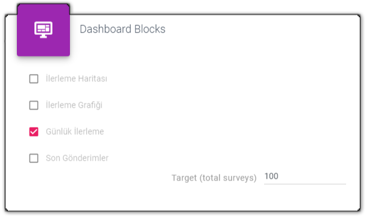
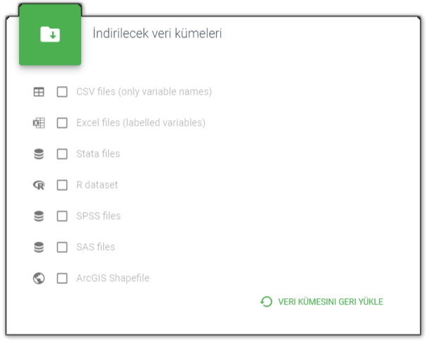
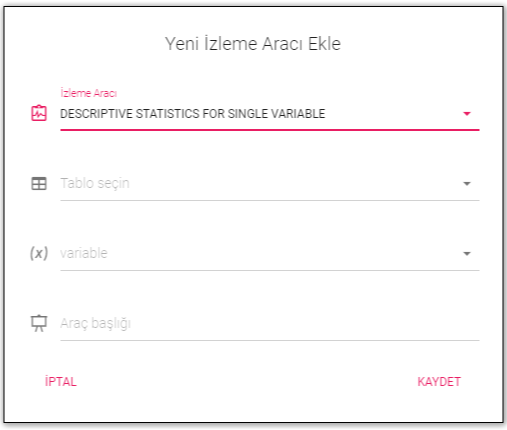
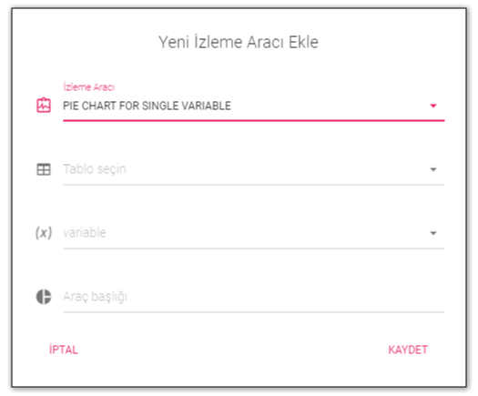
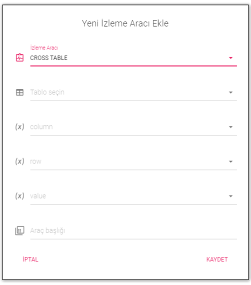

# İzleme Tercihleri
 
Yayınlanan her form için, veri toplamayı izlemeye başlamak için önce tercihler atamanız gerekir. Tüm olası ayarları görmek için `İzleme Tercihleri` butonuna tıklayın.
 

 
## İzleme Blokları
 
İzleme blokları, anket formunuzdaki gönderiler hakkında bilgi içeren bölümdür. GPS toplarsanız veya enlem ve boylam verilerini girerseniz, `Haritadaki ilerleme` yi izlersiniz. Ayrıca orada `İlerleme Grafiği`, `Günlük İlerleme` ve `En Son Gönderimler` blokları da mevcuttur. Onları etkinleştirebilirsiniz. Gösterge Tablosuna yalnızca seçilen blok dahil edilecek.
 

 
### İlerleme Haritası
 
Anket formunuzda konum verilerini toplarsanız,`İlerleme Haritası` seçeneğini etkinleştirmek, harita üzerinde veri toplama ilerlemesini [Gösterge Paneli](/guide/30-dashboard.md) aracılığıyla izlemenize ve ayrıca [Harita Tahtası Bölüm](/guide/45-mapboard.md). öğesini etkinleştirmenize olanak tanır. Bu seçimi etkinleştirmek için anket formundan `Boylam` ve `Enlem` değişkenlerini seçmelisiniz.
 

 
### İlerleme Grafiği
 
İlerleme Grafiği bloğu, belirli bir değişkenin seçilmesini gerektirmez, tablo seçmeniz gerekir:
 

 
Ayrıca hedefinizi belirtmeniz gerekir - sahadan toplamayı planladığınız toplam gönderi sayısı. Varsayılan sayı 100'dür, buna göre değiştirirsiniz.
 

 
### Günlük İlerleme
 
Günlük ilerleme, veri toplama açısından mevcut ilerleme ve önceki günlerin istatistikleri hakkında bilgi verecektir. Bu blokta ayrıca veri toplama ilerlemesinin başlangıç tarihini ve kalan anketleri görebilirsiniz.
 

 
Burada ayrıca hedefinizi belirtmeniz gerekir - sahadan toplamayı planladığınız toplam gönderi sayısı. Varsayılan sayı 100'dür, buna göre değiştirirsiniz.
 

 
### En Son Gönderimler
 
En son gönderim bloğu, son günlerin veri toplama istatistikleri için eğilimleri gösteren bir çubuk grafiktir. Bu bloğu etkinleştirirken, bu çubuk grafiğe kaç gün dahil etmek istediğinizi belirtmeniz gerekir.
 

 
## Veri Kümesi Türleri
 
UDACAPI, veri kümenizi aşağıdaki biçimlerden herhangi birinde indirmenize izin verir. Veri kümesini Gösterge Panelinde o formatta indirebilmek için bunlardan herhangi birini etkinleştirin. 
 

 
## İzleme Araçları
 
İzleme araçlarının yardımıyla sahadan veri toplarken herhangi bir soruya verilen yanıtları gözlemleyebilirsiniz. Sayısal cevaplar için `Betimsel İstatistikler` dahil olmak üzere *maksimum*, *minimum*, ve *ortalama* değerler ve ayrıca  *medyan*, *standart sapma*, vb. Kategorik değişkenler için, Pivot tablosu olarak bilinen bir  `Dilim Grafik` ve `Çapraz Tablo` olabilir. İzleme aracını eklemek için `Yeni Öğe` butonuna tıklayın.
 

 
### Betimleyici İstatistik
 
Yeni bir tanımlayıcı istatistik aracı eklemek için, tablo ve bu tablodan bir değişken seçmeniz gerekir. Ardından bu araç için bir  başlık verin ve`Kaydet`e tıklayın.
 

 
### Dilim Grafiği
 
`Dilim Grafiği` de bir *tablo* seçilmesini ve bu tablodan bir değişken gerektirir. Ardından bu araç için bir başlık verin ve `Kaydet`e tıklayın.
 

 
### Çapraz Tablo
 
Bir tablo seçtikten sonra `Çapraz Tablo` aracı için, ayrıca *Sütun*, *Satır* ve *Değer* için bir değişken seçmeniz gerekir (Değer olarak benzersiz bir kimlik sütunu seçebilirsiniz). Ardından bu araç için bir başlık yazın ve `Kaydet`e tıklayın.
 
