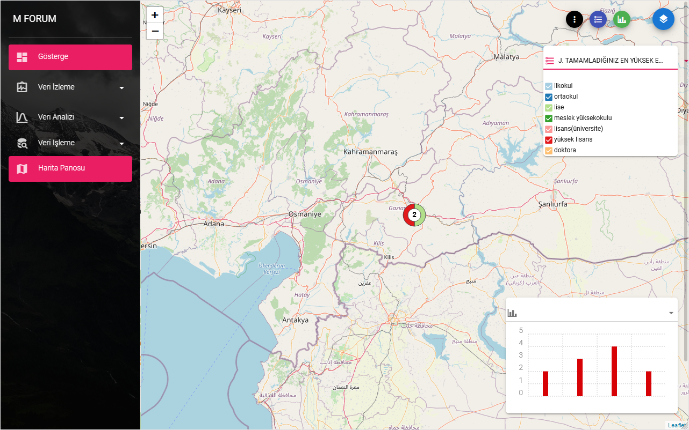
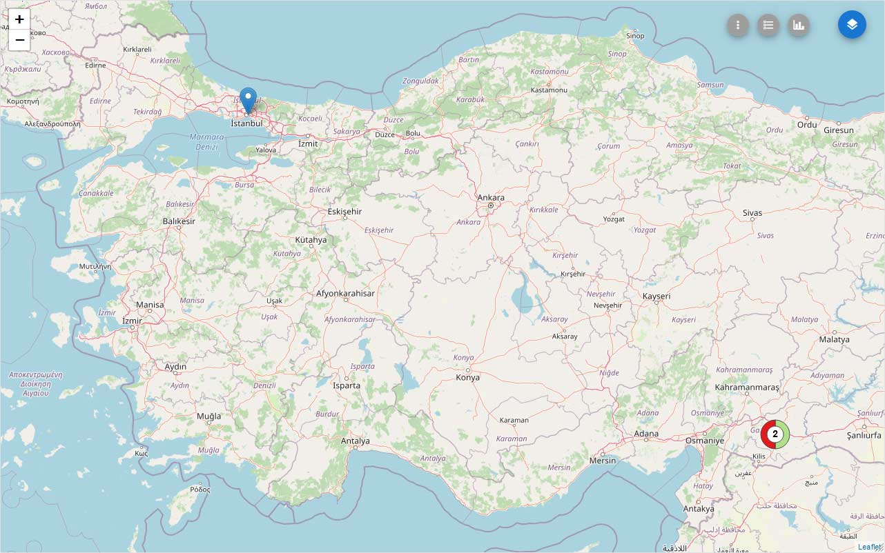
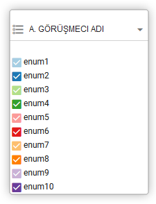
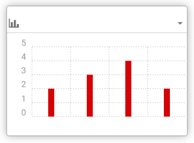

# Harita Panosu
 
Anket formunuzda konum verilerini topladıysanız ve [İzleme Tercihleri](./21-preferences.html##progress-map) sayfasından `İlerleme Haritası` nı etkinleştirdiyseniz `Harita Panosu`nu kullanabilirsiniz. 
 

 
`Harita Panosu`nun sağ üst köşesindeki kontrol butonlarının ilk butonu, 
 

 
haritayı tam sayfa yapan gezinme çubuğunu açar / kapatır.
 

 
İkinci buton  brings the `Filtre aracı` nı getirir -  Kategorik soruların listesi. Her seçim seçeneği halka grafiğin bir bölümüne karşılık gelir ve yanıtlara göre filtrelenen verileri görmek için yanıtı kapatabilirsiniz.
 

 
Sonraki buton  histogram olarak anketinizden sayısal verilerin dağılımının yaklaşık bir temsilini `Histogram aracını` etkinleştirir.
 

 
Bu histogram, yukarıdaki `Filtre aracı`ile filtrelenen verilerin dağılımını temsil eder.
