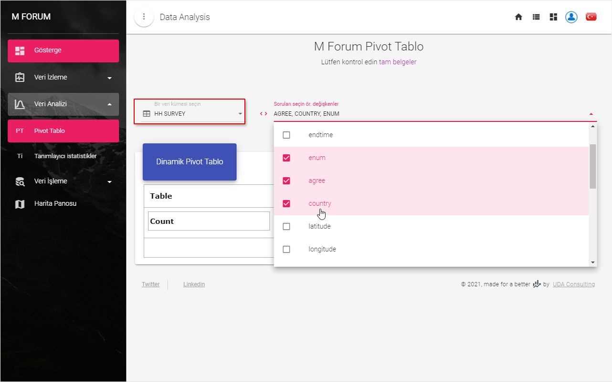
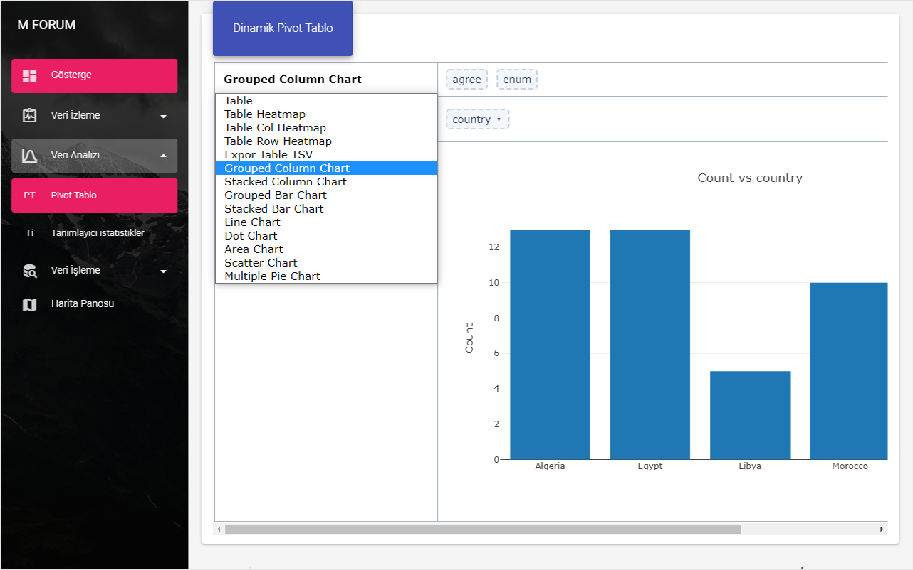
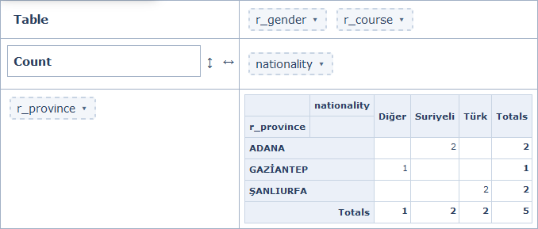
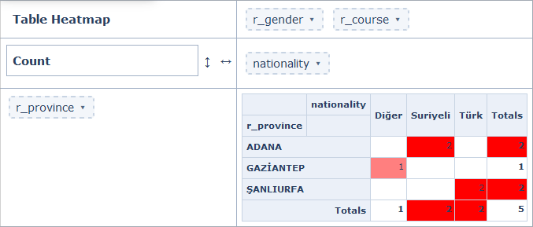
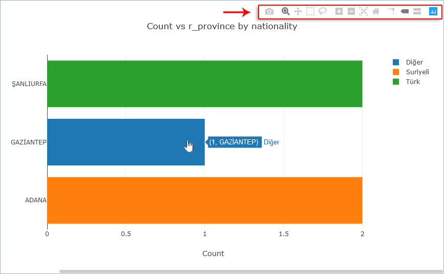
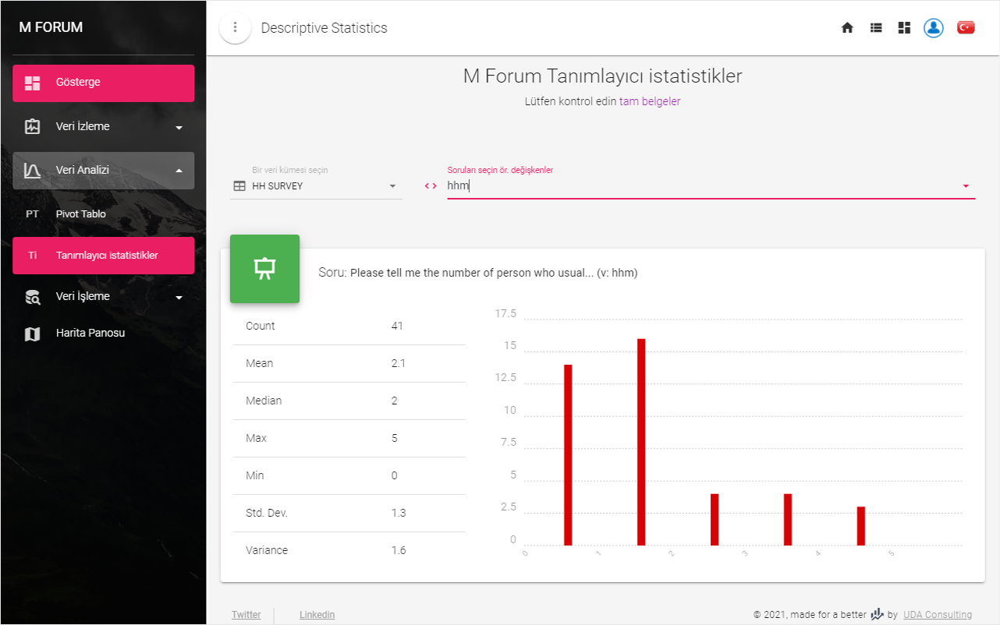

# Veri Analizi
 
## Pivot Tablo
 
`Pivot tablo` , soruların dinamik çapraz analizini sağlar. Bu analiz bir  **çapraz tablo**, farklı **grafik** veya **ısı haritası** tabloları, vb. olabilir.
 
Önce bir tablo seçin, ardından bu tablodan sorular (ör. Değişkenler)
 

 
::: tip
Butona tıklayarak soru kodu (değişken adları) ve soru etiketleri (değişken etiketler) arasında geçiş yapabilirsiniz 
:::
::: details

:::
 
`pivot tablo` türünü değiştirmek için tablonun sol üst köşesini tıklayın ve bu listeden türlerden birini seçin.
 

 
`pivot tablo`nun çapraz tablo görünümü:
 

 
`Isı haritası` tablo görünümü:
 

 
Verilerinizi grafik olarak görselleştirirseniz, görünümü değiştirebilir ve bir grafik araç çubuğu kullanarak görüntü dosyası olarak indirebilirsiniz.
 

 
## Betimleyici İstatistikler
 
Bu bölüm, bazı istatistiksel göstergeleri (sayı, ortalama, medyan, maksimum, minimum, standart sapma, varyans, vb.) ve bir histogram - sayısal değerlere sahip sorular için dağılımın yaklaşık gösterimini hızlı bir şekilde almanızı sağlar. Bunun için bir tablo ve bir soru seçmelisiniz.
 

 