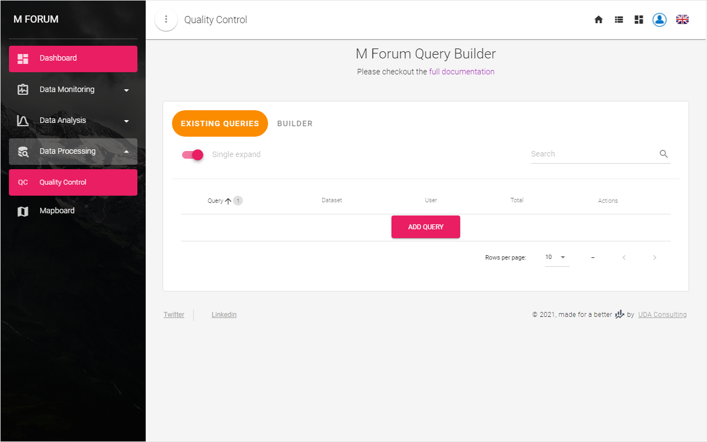
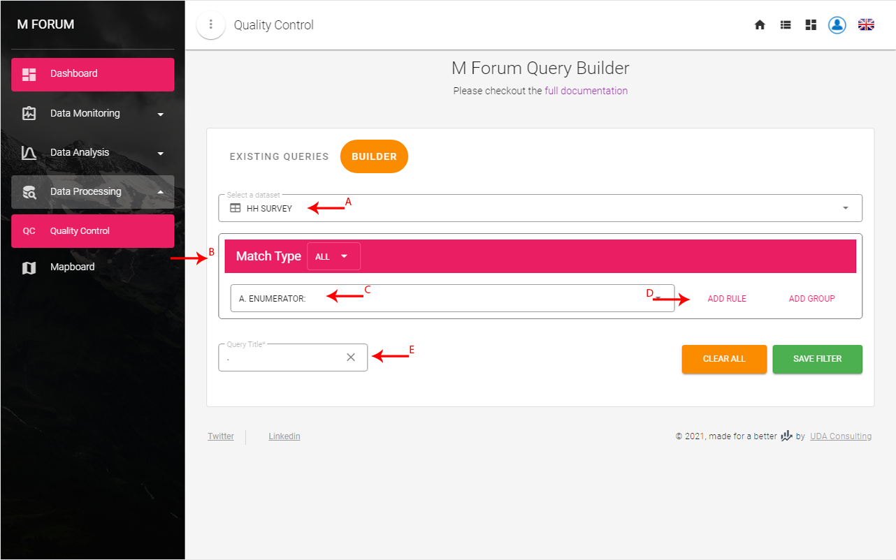
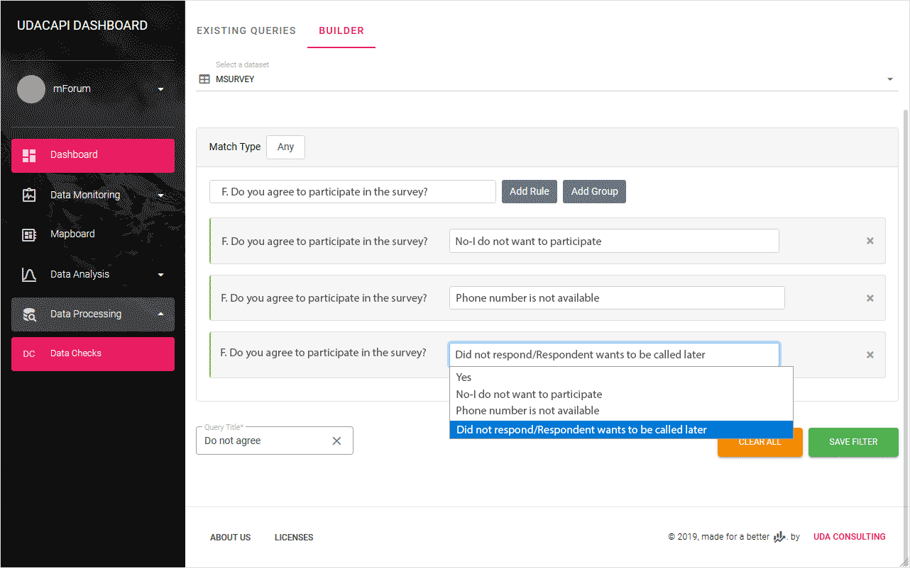
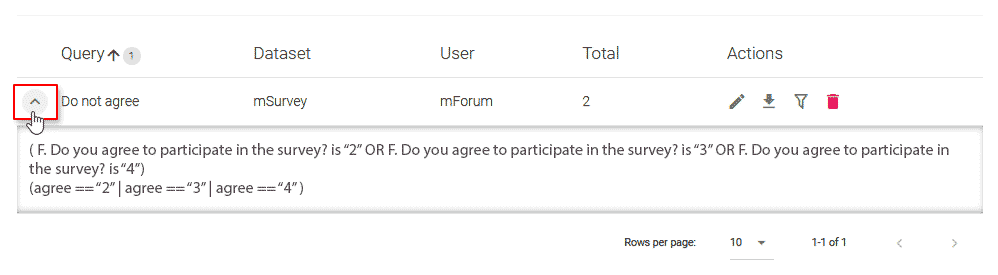
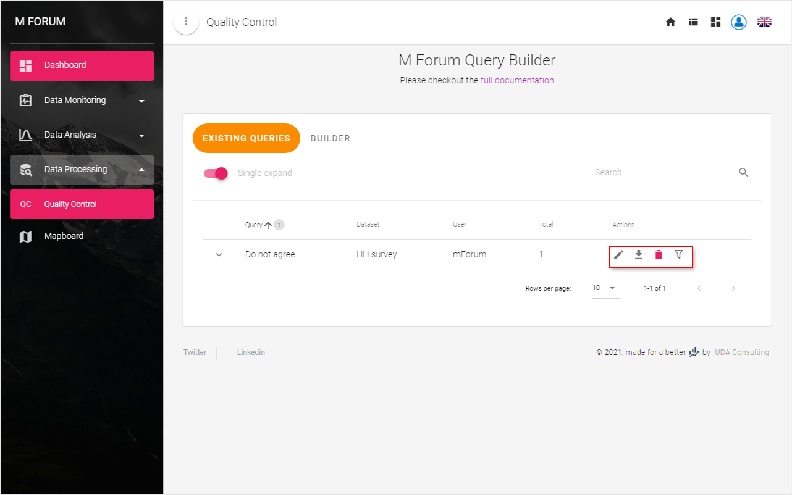

# Veri İşleme
 
## Kalite Kontrol
 
Sorgu oluşturucu, veri kümenizi olası tutarsızlıklar için kontrol etmenize yardımcı olacaktır. `SORGU EKLE` butonuna veya `OLUŞTURUCU` sekmesini tıklayarak yeni bir sorgu ekleyebilirsiniz.
 

 
### Yeni Sorgu Oluşturma
 
Bir sorgu oluşturucu kullanmak, herhangi bir karmaşıklıkta bir sorgu tasarlayabilir. Bunun için:
A) Bir veri kümesi seçin;
B) `Eşleşme Türü`nü seçin;
C) Bir soru seçin;
D) Bu soru için `Kural Ekle` yi tıklayın;
E) Bu sorgu için bir isim veriniz;
Sonra bu filtreyi kaydedebilirsiniz.
 

 
::: details Örnek
Diyelim ki telefon anketi yaptığınızı ve sorunuzu sorduğunuzda:
 
**F. Ankete katılmayı kabul ediyor musunuz?** sorusunun yanıt seçenekleri ile:
* *Evet*
* *Hayır-katılmak istemiyorum*
* *Telefon numarası mevcut değil*
* *Cevap vermedi/ Yanıtlayan daha sonra aranmak istiyor*
 
Kaç gönderinin anket verisine sahip olmadığını bilmek istiyorsunuz. Ör.**F. Ankete katılmayı kabul ediyor musunuz?** sorunun cevabı *Evet*. dışında seçildi. Bu durumda, sorgu oluşturucuda `Eşleşme Türü` **Herhangi** olacaktır ve *Evet* dışındaki üç yanıt seçeneğinin tümü için üç kural ekleyebilirsiniz.
.
 
Bakınız: 
 

 
Bu, *"F sorusunun cevabının bulunduğu gönderiyi bulun” şeklinde okunacaktır. F. Ankete katılmayı kabul ediyor musunuz? -'Hayır-Katılmak istemiyorum' Ya Da 'Telefon numarası mevcut değil' Veya 'Yanıt vermedi/ Yanıtlayan daha sonra aranmak istiyor.'"*
:::
 
### Mevcut Sorguyu Düzenleyin
 
Tüm sorgularınız `MEVCUT SORGULAR` sekmesi altında listelenecektir.  `Genişlet` butonuna tıklayarak her bir sorgunun ayrıntılarını görebilirsiniz.
 

 
Sorgu listesinin **İşlemler** sütununun altında dört buton vardır.
 

 
Mevcut sorguyu değiştirmek için butonuna tıklayın  `Sorguyu Düzenle`
 
### Sorgu Sonuçlarını İndirin
 
**İşlemler ** sütununun altındaki  `Sonuçları indir` butonuna tıklayarak sorgularınızın sonuçlarını indirebilirsiniz.Bu, [İzleme Tercihleri](/guide/21-preferences.md#types-of-dataset) sayfasında etkinleştirdiğiniz tüm veri kümeleri için sorgu sonucunun arşivlenmiş sürümünü indirecektir.
 
### Sorgu Silme
 
Sorguya ihtiyacınız yoksa, **İşlemler** sütunun altındaki  `Bu Sorguyu Sil` butonuna tıklayarak silebilirsiniz.
 
### Sorgu Sonuçlarını Dahil Etmemek
 
Bazen bir sorgunun sonuçlarını veri kümelerinizden hariç tutmak isteyebilirsiniz, böylece süreci doğru verilere sahip gönderimlerle takip edebilirsiniz. Yukarıdaki örnekte olduğu gibi, yanıtlayanların kabul edilmediği tüm gönderimleri  [Gösterge Paneli](/guide/30-dashboard.md) istatistiklerinden ve  [Veri Kümelerinizden](/guide/21-preferences.html#types-of-dataset) hariç tutmak istiyorsanız `Sonuçları veri kümesinden hariç tut` butonuna tıklayın. 
 
::: tip
1. Liste tablolarının sorguları için filtre düğmesi kullanılamaz.
2. Sonuçları hariç tutmak gönderimlerinizin hiçbirini silmez, ayrıca sorguları istediğiniz zaman düzenleyebilir veya silebilirsiniz.
:::
